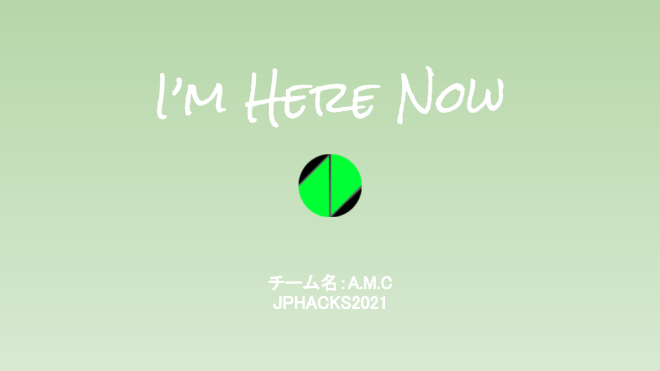
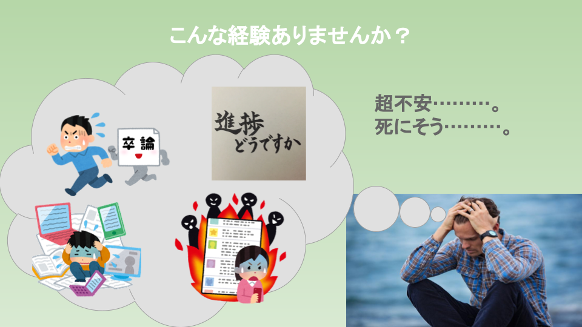
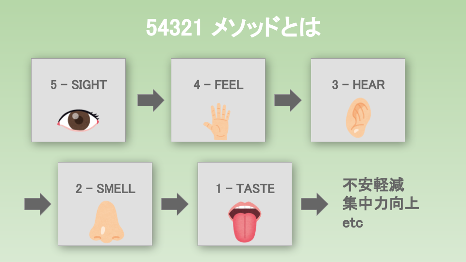
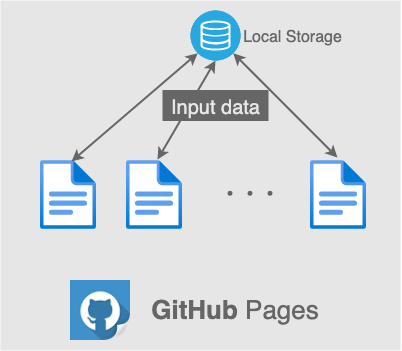

# I'm Here Now

## 製品概要 
### Grounding X Tech
### 背景（製品開発のきっかけ、課題等）
人間社会に不安は尽きないものです。昨今のコロナ禍により市場は劇的に移り変わり、 IT 技術の加速度的な発達で我々の将来はより予測できないものとなっています。さらに自身の行動の選択でいつコロナに罹患するか分からない、目に見えない脅威は知らぬうちに私たちの心を蝕んでいるように感じます。またコロナに限らず、私たちは過去の失敗への後悔、雲をつかむような不確実な未来への不安、そして SNS の発達により数えきれない自分より優秀な人間との比較などにより無限に苦しみます。その様な不安で心の平穏が乱されている状況では我々は満足に目標を達成させるための歩みを進められないと考えます。そのような課題を解決するために、無尽蔵な不安から心を切り離し「いまここ」への集中を取り戻し再び我々が人生の目標を達成するために歩みだせるようになることを目的とした Web アプリを作成しました。

### 製品説明（具体的な製品の説明）
インドの Manipal University の Abdul Imran 氏が 2020 年に論文で発表した 54321 メソッドというストレス対策技術を使って不安を軽減させます。 5 つの視覚情報、 4 つの触覚情報、 3 つの聴覚、 2 つの嗅覚、 1 つの味覚をテキストとして入力してもらう事で意識を「いまここ」に集中できるようになり不安を軽減する効果が期待できます。引用元では声に出してもらう事を推奨していますが、実際に手を動かしていただくことで意識をより現在に集中させることを意図しています。

### 参考文献
Imran, A. (2020, September 28). Combat against stress anxiety and panic attacks 5-4-3-2-1 coping technique. Journal of Traumatic Stress Disorders & Treatment. Retrieved October 29, 2021, from https://www.scitechnol.com/peer-review/combat-against-stress-anxiety-and-panic-attacks-54321-coping-technique-WiRy.php?article_id=12841. 
### 特長
#### 特長1  5 感から得られる情報を順番にテキストとして入力する事で意識を段階的に「いまここ」へ誘導します。
#### 特長2 アプリ使用前に現在抱いていてる不安の内容と程度を入力します。
#### 特長3 アプリ使用後にその不安の程度がどのように変化したかを確認してもらい、不安から心が切り離されて意識が「いまここ」に戻ってきたことを体感してもらいます。
### 解決出来ること
不安軽減効果が期待できます。  
リラックスにより集中力の増加が望めます。  
人前で話す、 SNS からの執拗な通知、テストへのプレッシャーなどの急速的なストレスの緩和に向いています。
### 今後の展望
他のコーピングテクニックをくっつけて、ストレス対策アプリの集合にするなど  
それぞれのコーピングテクニックへのお気に入り機能（ユーザーが効果を感じるコーピングリストが作れる）  
アプリの使用時間のカウント機能（瞑想は練習すればするだけ効果を実感できます。モチベーション維持目的）
### 注力したこと（こだわり等）
* 実際に手を動かすという運動の要素を取り入れたこと。それにより強制的に意識を不安から切り離すことができます。
* アプリ使用前後の不安の程度の変化を知覚してもらうこと。その作業により不安を抱いている心の状態と「いまここ」に集中している状態には物理的な距離があることを実感できます。

## 開発技術

### 活用した技術
#### フロントエンド
- HTML/CSS
- Javascript

#### バックエンド
- なし

#### DB
- Javascript の Local Storage を利用
#### インフラ
- GitHube Pages で公開

#### ツール
- Git
- VS Code
- Miro

### 独自技術
#### ハッカソンで開発した独自機能・技術
* 独自で開発したものの内容をこちらに記載してください
* 特に力を入れた部分をファイルリンク、またはcommit_idを記載してください。

#### 製品に取り入れた研究内容（データ・ソフトウェアなど）（※アカデミック部門の場合のみ提出必須）
* 
* 
